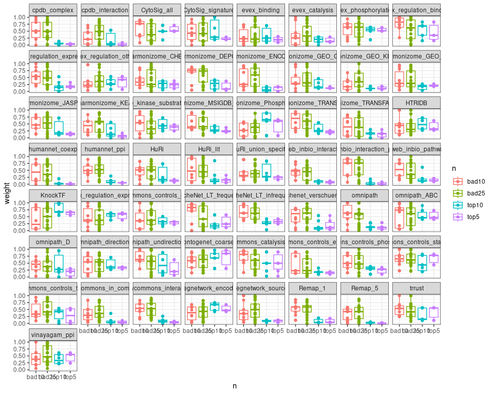
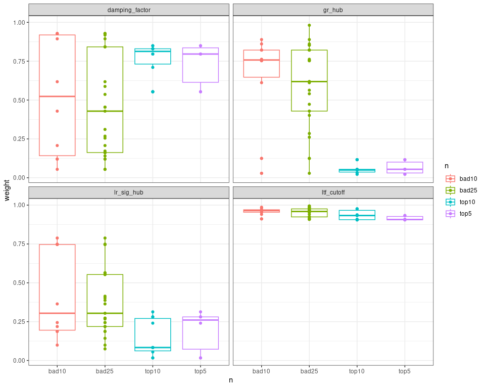
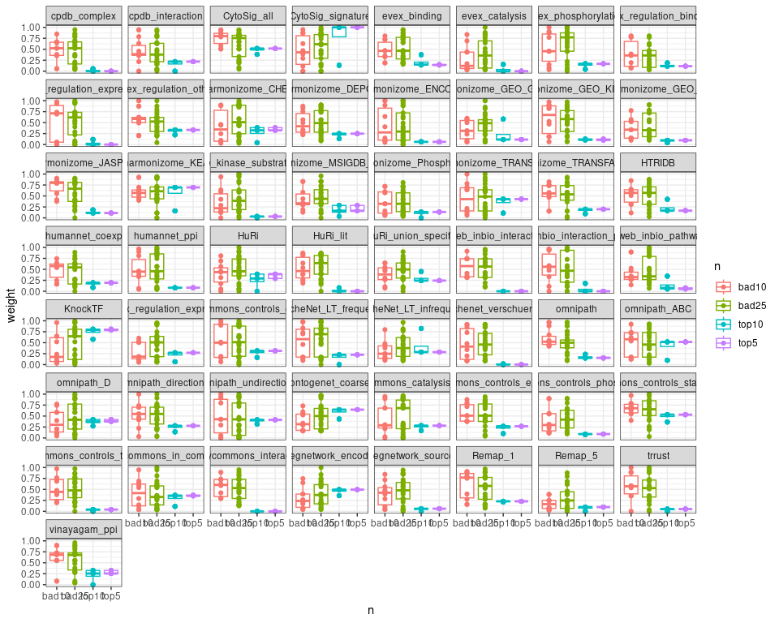
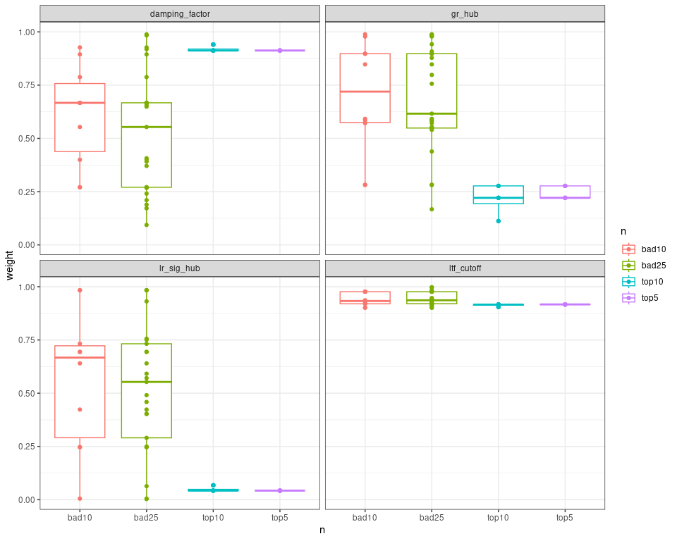
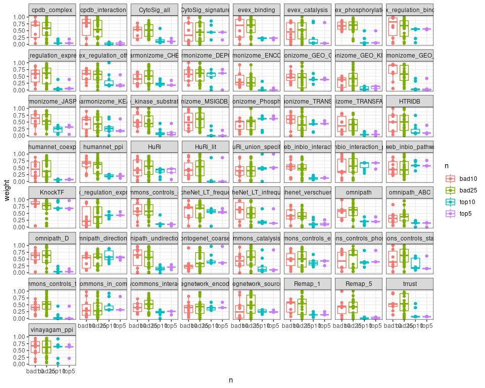
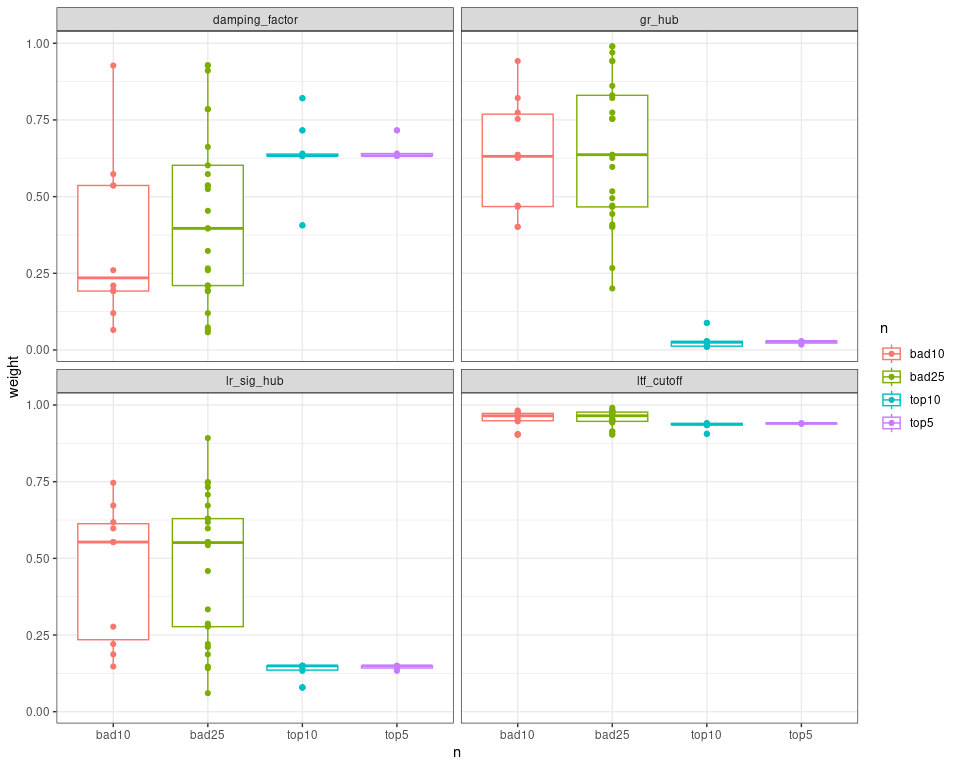
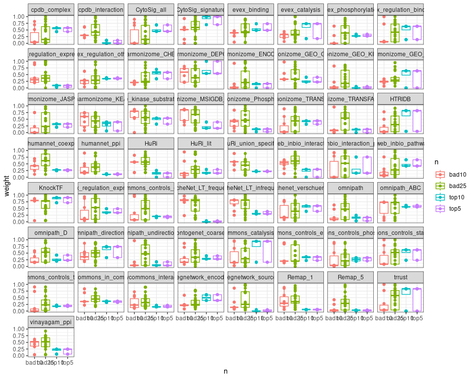
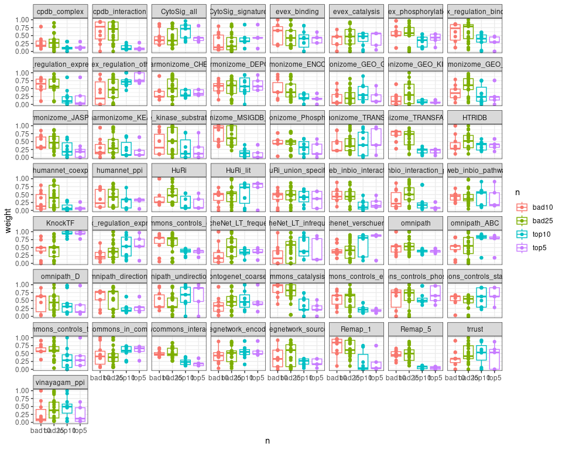

Parameter optimization via NSGA-II
================
Robin Browaeys & Chananchida Sang-aram
2023-01-03

<!-- github markdown built using 
rmarkdown::render("vignettes/parameter_optimization.Rmd", output_format = "github_document") # please, don't run this!!
knitr::opts_knit$set(root.dir = "~/NicheNet_V2/evaluation/optimization") # set root directory
-->

This vignette shows how we optimized both hyperparameters and data
source weights via NSGA-II, a non-dominated sorting genetic algorithm.
Because the optimization requires intensive parallel computation, we
performed optimization in parallel on a high performance computing (HPC)
cluster. The old code for parameter optimization via mlrMBO can be
accessed by browsing the repository history during NicheNet v1.

This script is merely illustrative and should be adapted by the user to
work on its own system.

All network and validation datasets can be downloaded from
[Zenodo](https://zenodo.org/records/8016880), under “NicheNet_V2.zip”.

First, we will load in the required packages and networks we will use to
construct the models which we will evaluate during the optimization
procedure.

``` r
devtools::load_all("~/nichenetr/")
library(tidyverse)
library(nsga2R)

# Path is relative to 'optimization.Rproj' in the zip file (evaluation/optimization/)
lr_network <- readRDS("../../networks/data/ligand_receptor/lr_network_human_21122021.rds")
sig_network <- readRDS("../../networks/data/signaling/signaling_network_human_21122021.rds")
gr_network <- readRDS("../../networks/data/gene_regulatory/gr_network_human_21122021_optimization.rds")

# Get names of all data sources
source_names <- c(lr_network$source, sig_network$source, gr_network$source) %>% unique()
source_names_zero_possible <- c(sig_network$source, gr_network$source) %>% unique()

# nsga2r parameters
n_param <- length(source_names) + 4
n_obj <- 4
lower_bounds <- c(rep(0,times = length(source_names)), 0, 0, 0.9, 0.01)
upper_bounds <- c(rep(1,times = length(source_names)), 1, 1, 0.999, 0.99)
```

To perform optimization, we will use the ligand treatment validation
datasets and try to optimize the parameters to maximize both target gene
and ligand activity prediction. We used 5-fold cross validation, i.e.,
4/5th of dataset was used for training the parameters, and 1/5th of the
dataset was used to evaluate the final performance.

``` r
# Choose 1 fold
fold <- "1234" # c("1234", "2345", "1345", "1245", "1235")

# Load in validation datasets corresponding to the fold
settings_CV <- readRDS(paste0("settings_training_f", fold))
settings <- settings_CV$settings

# Remove databases from GRN if it is in the validation dataset
gr_network <- readRDS("../../networks/data/gene_regulatory/gr_network_human_21122021_optimization.rds")
forbidden_gr <- bind_rows(
  gr_network %>% filter(database == "NicheNet_LT" & from %in% settings_CV$forbidden_ligands_nichenet),
  gr_network %>% filter(database == "CytoSig" & from %in% settings_CV$forbidden_ligands_cytosig)
)
gr_network <-  gr_network %>% setdiff(forbidden_gr)
forbidden_gr %>% filter(database %in% c("NicheNet_LT", "CytoSig")) %>% pull(source) %>% table()
gr_network %>% filter(database %in% c("NicheNet_LT", "CytoSig")) %>% pull(source) %>% table()

# Perform optimization
set.seed(1)
results <- run_nsga2R_cluster(model_evaluation_optimization_nsga2r,
                              # nsga2R params
                              varNo=n_param,
                              objDim=n_obj,
                              lowerBounds= lower_bounds,
                              upperBounds=upper_bounds,
                              popSize = 360,
                              tourSize = 2,
                              generations = 15,
                              ncores = 8,
                              # model_evaluation_optimization_nsga2r params
                              source_names = source_names,
                              algorithm = "PPR",
                              correct_topology = FALSE,
                              lr_network = lr_network,
                              sig_network = lr_network,
                              gr_network = gr_network,
                              settings = settings,
                              secondary_targets = FALSE,
                              remove_direct_links = "no",
                              damping_factor = NULL)

# Save results object
readr::write_rds(results, paste0("results/cv_", fold, "_ltfcutoff_nsga2r_final.rds"))

# Save parameters
optimized_parameters <- get_optimized_parameters_nsga2r(results, source_names)
saveRDS(optimized_parameters, paste0("results/cv_", fold, "_ltfcutoff_nsga2r_optimized_parameters_final.rds"))
```

In the real implementation, we submitted the code chunks above as an R
script to the HPC in 5 separate jobs (one per cross-validation fold).
Our job submission script looks as follows:

``` bash
#!/bin/bash -l
#PBS -l nodes=1:ppn=48
#PBS -l mem=64gb
#PBS -l walltime=72:00:00

module load R/4.2.0-foss-2021b
module load R-bundle-Bioconductor/3.15-foss-2021b-R-4.2.0

cd $PBS_O_WORKDIR
Rscript scripts/nsga2r_optimization.R
```

The submission command is as follows:

``` bash
for i in {1..5}
do
qsub qsub_script.pbs -v "CV_NO=${i}" -N nsga2r_cv${i}
done
```

This submits the job with the environment variable `CV_NO` that can be
used by the script. This requires us to define `fold` differently.

``` r
cv_names <- c("1234", "2345", "1345", "1245", "1235")
task_id <- as.numeric(Sys.getenv("CV_NO")) #from 1-5
fold <- cv_names[task_id]
```

Once the job is finished (which can take a few days - for shorter
running time: reduce the number of iterations), we can analyze the
output of each fold and combine the results together. By default,
`get_optimized_parameters_nsga2r` will retrieve the value of the
parameters at the final iteration. However, in genetic algorithms it may
be possible that equally good or better solution could have existed in
some iterations or populations. Thus, we also allow users to set
`search_all_iterations = TRUE`. The `top_n` values will then select the
top number of populations that have the best value (based on the
geometric mean of the objective functions).

``` r
for (fold in cv_names){
  res_job_nsga2r_multi <- readRDS(paste0("results/cv_", fold, "_ltfcutoff_nsga2r_final.rds"))
  
  # Visualize source weights
  print(visualize_parameter_values(res_job_nsga2r_multi, source_names))
  
  for (n in c(25, 5, 1)){
    
    optimized_df <- get_optimized_parameters_nsga2r(result_nsga2r = res_job_nsga2r_multi,
                                    source_names = source_names,
                                    search_all_iterations = TRUE,
                                    top_n = n,
                                    summarise_weights = TRUE)
    
    # saveRDS(optimized_df$source_weight_df, paste0("results/fold", fold, "_sourceweights_top", n, ifelse(n == 1, "", "_summarized"), ".rds"))
    # saveRDS(optimized_df$hyperparams_df, paste0("results/fold", fold, "_hyperparameters_top", n, ifelse(n == 1, "", "_summarized"), ".rds"))
  }
}
## $source_weights_boxplot
```

<!-- -->

    ## 
    ## $hyperparameters_boxplot

<!-- -->

    ## 
    ## $source_weights_boxplot

<!-- -->

    ## 
    ## $hyperparameters_boxplot

<!-- -->

    ## 
    ## $source_weights_boxplot

<!-- -->

    ## 
    ## $hyperparameters_boxplot

<!-- -->

    ## 
    ## $source_weights_boxplot

<!-- -->

    ## 
    ## $hyperparameters_boxplot

<!-- -->

    ## 
    ## $source_weights_boxplot

<!-- -->

    ## 
    ## $hyperparameters_boxplot

<!-- -->

We can also visualize differences across folds.

``` r
list_optimization_results <- lapply(cv_names, function(fold){
  readRDS(paste0("results/cv_", fold, "_ltfcutoff_nsga2r_final.rds"))
})
 
print(visualize_parameter_values_across_folds(list_optimization_results, source_names, 5))
## $source_weights_boxplot
```

<!-- -->

    ## 
    ## $hyperparameters_boxplot

<!-- -->

``` r

# The top 25 seems to have more overlap
print(visualize_parameter_values_across_folds(list_optimization_results, source_names, 25))
## $source_weights_boxplot
```

<!-- -->

    ## 
    ## $hyperparameters_boxplot

<!-- -->

Finally, we can compute the average value of top 25 populations across
all folds.

``` r
# Get average across all folds
for (top_n in c(5, 25)){
  all_optimized_weights <- lapply(1:length(list_optimization_results), function(i){
    get_optimized_parameters_nsga2r(list_optimization_results[[i]],
                                    source_names,
                                    search_all_iterations = TRUE,
                                    top_n = top_n,
                                    summarise_weights = FALSE) %>%
      lapply(mutate, fold = paste0("Fold", i))
  })
  
  all_optimized_source_weights_summarised <- purrr::map(all_optimized_weights, "source_weight_df") %>% bind_rows() %>% 
    group_by(source) %>% summarise(avg_weight = mean(weight), median_weight = median(weight))
  
  all_optimized_hyperparams_df_summarised <- purrr::map(all_optimized_weights, "hyperparams_df") %>% bind_rows() %>% 
    group_by(parameter) %>% summarise(avg_weight = mean(weight), median_weight = median(weight))
  
  # saveRDS(all_optimized_source_weights_summarised, paste0("results/all_sourceweights_top", top_n, "_summarized_final.rds"))
  # saveRDS(all_optimized_hyperparams_df_summarised, paste0("results/all_hyperparameters_top", top_n, "_summarized_final.rds"))
  
  # readRDS(paste0("results/all_sourceweights_top25_summarized_final.rds")) %>% write_tsv("results/source_weights_df_final.txt")
  # readRDS(paste0("results/all_hyperparameters_top25_summarized_final.rds")) %>% write_tsv("results/hyperparameters_df_final.txt")
}
```
