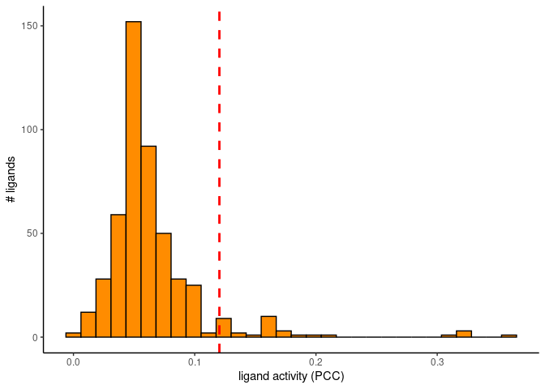
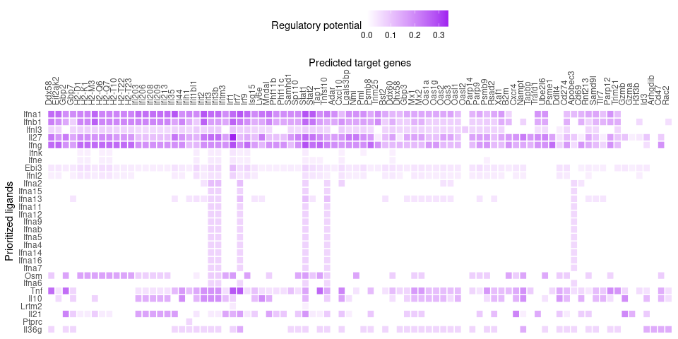
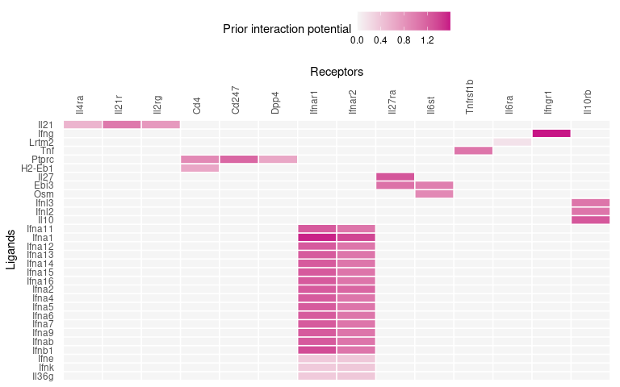
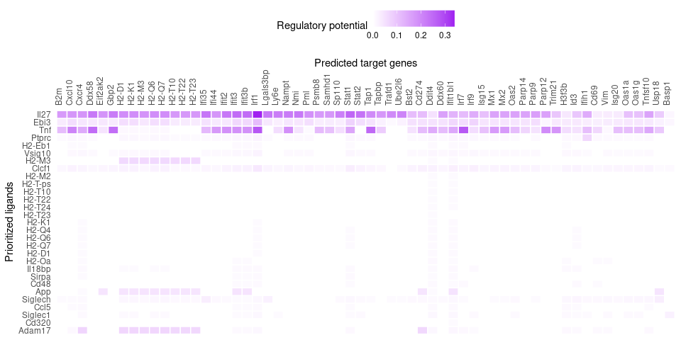
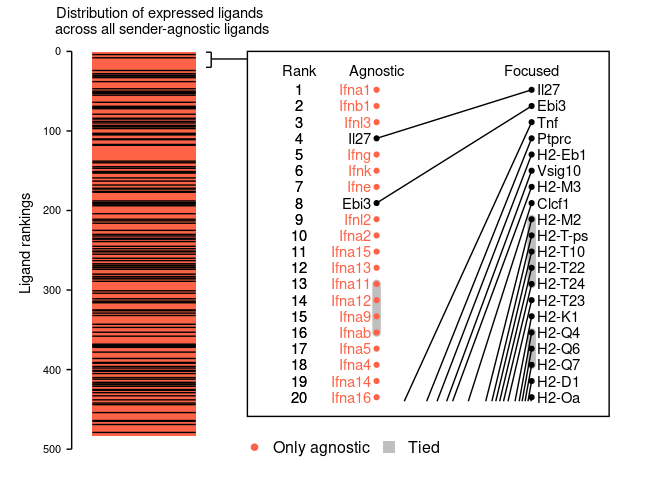
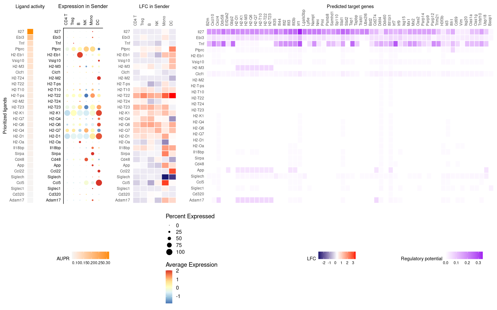

Perform NicheNet analysis starting from a Seurat object: step-by-step
analysis
================
Robin Browaeys & Chananchida Sang-aram
2023-10-02

<!-- github markdown built using 
rmarkdown::render("vignettes/seurat_steps.Rmd", output_format = "github_document")
-->

In this vignette, you can learn how to perform a basic NicheNet analysis
on a Seurat (v3-v5) object containing single-cell expression data. The
steps of this vignette can also be adapted for other single-cell or bulk
frameworks.

**Assuming you have captured the changes in gene expression resulting
from your cell-cell communication (CCC) process of interest,** a
NicheNet analysis can help you to generate hypotheses about the CCC
process. Specifically, NicheNet can predict 1) which ligands from the
microenvironment or cell population(s) (“sender/niche”) are most likely
to affect target gene expression in an interacting cell population
(“receiver/target”) and 2) which specific target genes are affected by
which of these predicted ligands.

To perform a NicheNet analysis, three features are extracted from the
input data: the potential ligands, the gene set of interest, and the
background gene set. This vignette will extract each feature as
described in this flowchart:


As example expression data of interacting cells, we will use mouse
NICHE-seq data to explore intercellular communication in the T cell area
in the inguinal lymph node before and 72 hours after lymphocytic
choriomeningitis virus (LCMV) infection (Medaglia et al. 2017). We will
focus on CD8 T cells as the receiver population, and as this dataset
contains two conditions (before and after LCMV infection), the
differentially expressed genes between these two conditions in CD8 T
cells will be used as our gene set of interest. We will then prioritize
which ligands from the microenvironment (sender-agnostic approach) and
from specific immune cell populations like monocytes, dendritic cells,
NK cells, B cells, and CD4 T cells (sender-focused approach) can
regulate and induce these observed gene expression changes.

Please make sure you understand the different steps described in this
vignette before performing a real NicheNet analysis on your data. There
are also wrapper functions that perform the same steps as in this
vignette in [Perform NicheNet analysis starting from a Seurat
object](seurat_wrapper.md). However, in that case users will not be able
to adapt specific steps of the pipeline to make them more appropriate
for their data.

The [ligand-target matrix](https://doi.org/10.5281/zenodo.7074290) and
the [Seurat object of the processed NICHE-seq single-cell
data](https://doi.org/10.5281/zenodo.3531889) can be downloaded from
Zenodo.

# Prepare NicheNet analysis

### Load packages

``` r
library(nichenetr) # Please update to v2.0.4
library(Seurat)
library(SeuratObject)
library(tidyverse)
```

### Read in the expression data of interacting cells

We processed and aggregated the original dataset by using the Seurat
alignment pipeline. As we created this object using Seurat v3, it has to
be updated with `UpdateSeuratObject`. Note that genes should be named by
their official mouse/human gene symbol.

``` r
seuratObj <- readRDS(url("https://zenodo.org/record/3531889/files/seuratObj.rds"))

seuratObj@meta.data %>% head()
##         nGene nUMI orig.ident aggregate res.0.6 celltype nCount_RNA nFeature_RNA
## W380370   880 1611      LN_SS        SS       1    CD8 T       1607          876
## W380372   541  891      LN_SS        SS       0    CD4 T        885          536
## W380374   742 1229      LN_SS        SS       0    CD4 T       1223          737
## W380378   847 1546      LN_SS        SS       1    CD8 T       1537          838
## W380379   839 1606      LN_SS        SS       0    CD4 T       1603          836
## W380381   517  844      LN_SS        SS       0    CD4 T        840          513

# For older Seurat objects, you may need to run this
seuratObj <- UpdateSeuratObject(seuratObj)
```

Additionally, if your expression data has the older gene symbols, you
may want to use our alias conversion function to avoid the loss of gene
names.

``` r
seuratObj <- alias_to_symbol_seurat(seuratObj, "mouse")
```

Visualize which cell populations are present: CD4 T cells (including
regulatory T cells), CD8 T cells, B cells, NK cells, dendritic cells
(DCs) and inflammatory monocytes.

``` r
# Note that the number of cells of some cell types is very low and should preferably be higher for a real application
seuratObj@meta.data$celltype %>% table() 
## .
##     B CD4 T CD8 T    DC  Mono    NK  Treg 
##   382  2562  1645    18    90   131   199

DimPlot(seuratObj, reduction = "tsne")
```

<!-- -->

Visualize the data to see to which condition cells belong. The metadata
column that denotes the condition (steady-state or after LCMV infection)
is here called ‘aggregate’.

``` r
seuratObj@meta.data$aggregate %>% table()
## .
## LCMV   SS 
## 3886 1141
DimPlot(seuratObj, reduction = "tsne", group.by = "aggregate")
```

<!-- -->

### Read in NicheNet’s networks

The ligand-target prior model, ligand-receptor network, and weighted
integrated networks are needed for this vignette. The ligand-target
prior model is a matrix describing the potential that a ligand may
regulate a target gene, and it is used to run the ligand activity
analysis. The ligand-receptor network contains information on potential
ligand-receptor bindings, and it is used to identify potential ligands.
Finally, the weighted ligand-receptor network contains weights
representing the potential that a ligand will bind to a receptor, and it
is used for visualization.

``` r
organism <- "mouse"

if(organism == "human"){
  lr_network <- readRDS(url("https://zenodo.org/record/7074291/files/lr_network_human_21122021.rds"))
  ligand_target_matrix <- readRDS(url("https://zenodo.org/record/7074291/files/ligand_target_matrix_nsga2r_final.rds"))
  weighted_networks <- readRDS(url("https://zenodo.org/record/7074291/files/weighted_networks_nsga2r_final.rds"))
} else if(organism == "mouse"){
  lr_network <- readRDS(url("https://zenodo.org/record/7074291/files/lr_network_mouse_21122021.rds"))
  ligand_target_matrix <- readRDS(url("https://zenodo.org/record/7074291/files/ligand_target_matrix_nsga2r_final_mouse.rds"))
  weighted_networks <- readRDS(url("https://zenodo.org/record/7074291/files/weighted_networks_nsga2r_final_mouse.rds"))

}

lr_network <- lr_network %>% distinct(from, to)
head(lr_network)
## # A tibble: 6 × 2
##   from          to   
##   <chr>         <chr>
## 1 2300002M23Rik Ddr1 
## 2 2610528A11Rik Gpr15
## 3 9530003J23Rik Itgal
## 4 a             Atrn 
## 5 a             F11r 
## 6 a             Mc1r
ligand_target_matrix[1:5,1:5] # target genes in rows, ligands in columns
##               2300002M23Rik 2610528A11Rik 9530003J23Rik            a          A2m
## 0610005C13Rik  0.000000e+00  0.000000e+00  1.311297e-05 0.000000e+00 1.390053e-05
## 0610009B22Rik  0.000000e+00  0.000000e+00  1.269301e-05 0.000000e+00 1.345536e-05
## 0610009L18Rik  8.872902e-05  4.977197e-05  2.581909e-04 7.570125e-05 9.802264e-05
## 0610010F05Rik  2.194046e-03  1.111556e-03  3.142374e-03 1.631658e-03 2.585820e-03
## 0610010K14Rik  2.271606e-03  9.360769e-04  3.546140e-03 1.697713e-03 2.632082e-03

head(weighted_networks$lr_sig) # interactions and their weights in the ligand-receptor + signaling network
## # A tibble: 6 × 3
##   from          to     weight
##   <chr>         <chr>   <dbl>
## 1 0610010F05Rik App    0.110 
## 2 0610010F05Rik Cat    0.0673
## 3 0610010F05Rik H1f2   0.0660
## 4 0610010F05Rik Lrrc49 0.0829
## 5 0610010F05Rik Nicn1  0.0864
## 6 0610010F05Rik Srpk1  0.123
head(weighted_networks$gr) # interactions and their weights in the gene regulatory network
## # A tibble: 6 × 3
##   from          to            weight
##   <chr>         <chr>          <dbl>
## 1 0610010K14Rik 0610010K14Rik 0.121 
## 2 0610010K14Rik 2510039O18Rik 0.121 
## 3 0610010K14Rik 2610021A01Rik 0.0256
## 4 0610010K14Rik 9130401M01Rik 0.0263
## 5 0610010K14Rik Alg1          0.127 
## 6 0610010K14Rik Alox12        0.128
```

# Perform the NicheNet analysis

In contrary to NicheNet v1, we now recommend users to run both the
“sender-agnostic” approach and “sender-focused” approach. These
approaches only affect the list of potential ligands that are considered
for prioritization. As described in the flowchart above, we do not
define any sender populations in the ‘sender agnostic’ approach but
consider all ligands for which its cognate receptor is expressed in the
receiver population. The sender-focused approach will then filter the
list of ligands to ones where the ligands are expressed in the sender
cell population(s).

## 1. Define a set of potential ligands for both the sender-agnostic and sender-focused approach

We first define a “receiver/target” cell population and determine which
genes are expressed. Here, we will consider a gene to be expressed if it
is expressed in at least 5% of cells (by default this is set to 10%).
The receiver cell population can only consist of one cell type, so in
case of multiple receiver populations, you will have to rerun the
vignette separately for each one. We will only look at CD8 T cells in
this vignette.

``` r
receiver = "CD8 T"
expressed_genes_receiver <- get_expressed_genes(receiver, seuratObj, pct = 0.05)
```

Get a list of all receptors available in the ligand-receptor network,
and define expressed receptors as genes that are in the ligand-receptor
network and expressed in the receiver. Then, define the potential
ligands as all ligands whose cognate receptors are expressed.

``` r
all_receptors <- unique(lr_network$to)  
expressed_receptors <- intersect(all_receptors, expressed_genes_receiver)

potential_ligands <- lr_network %>% filter(to %in% expressed_receptors) %>% pull(from) %>% unique()
```

For the sender-focused approach, define sender cell types (CD4 T, Treg,
Mono, NK, B, and DC) and expressed genes in all sender populations.
(Although we pool all ligands from all sender cell types together in
this step, later on during the interpretation of the output, we will
check which sender cell type expresses which ligand.) Then, filter
potential ligands to those that are expressed in sender cells. Note that
autocrine signaling can also be considered if we also include CD8 T
cells as a sender.

``` r
sender_celltypes <- c("CD4 T", "Treg", "Mono", "NK", "B", "DC")

# Use lapply to get the expressed genes of every sender cell type separately here
list_expressed_genes_sender <- sender_celltypes %>% unique() %>% lapply(get_expressed_genes, seuratObj, 0.05)
expressed_genes_sender <- list_expressed_genes_sender %>% unlist() %>% unique()

potential_ligands_focused <- intersect(potential_ligands, expressed_genes_sender) 

# Also check 
length(expressed_genes_sender)
## [1] 8492
length(potential_ligands)
## [1] 483
length(potential_ligands_focused)
## [1] 127
```

## 2. Define the gene set of interest

The gene set of interest are genes within the receiver cell type that
are likely to be influenced by ligands from the CCC event. In typical
case-control studies like this one, we use the differentially expressed
(DE) genes between the two conditions in the receiver cell type,
assuming that the observed DE pattern is a result of the CCC event
(i.e., LCMV infection). The condition of interest is thus ‘LCMV’,
whereas the reference/steady-state condition is ‘SS’. The condition can
be extracted from the metadata column ‘aggregate’. The method to
calculate the differential expression is here the standard Seurat
Wilcoxon test, but this can be changed if necessary.

``` r
condition_oi <-  "LCMV"
condition_reference <- "SS"

seurat_obj_receiver <- subset(seuratObj, idents = receiver)

DE_table_receiver <-  FindMarkers(object = seurat_obj_receiver,
                                  ident.1 = condition_oi, ident.2 = condition_reference,
                                  group.by = "aggregate",
                                  min.pct = 0.05) %>% rownames_to_column("gene")

geneset_oi <- DE_table_receiver %>% filter(p_val_adj <= 0.05 & abs(avg_log2FC) >= 0.25) %>% pull(gene)
geneset_oi <- geneset_oi %>% .[. %in% rownames(ligand_target_matrix)]
```

## 3. Define the background genes

All expressed genes in the receiver cell population (that are also in
the ligand-target matrix) is defined as the ‘background set’ for our
ligand prioritization procedure in the next step. It’s also important to
check that the number of background genes is a ‘reasonable’ number,
generally between 5000-10000, and sufficiently larger than our gene set
of interest.

``` r
background_expressed_genes <- expressed_genes_receiver %>% .[. %in% rownames(ligand_target_matrix)]

length(background_expressed_genes)
## [1] 3476
length(geneset_oi)
## [1] 260
```

## 4. Perform NicheNet ligand activity analysis

This is the main step of NicheNet where the potential ligands are ranked
based on the presence of their target genes in the gene set of interest
(compared to the background set of genes). In this case, we prioritize
ligands that induce the antiviral response in CD8 T cells.

Ligands are ranked based on the area under the precision-recall curve
(AUPR) between a ligand’s target predictions and the observed
transcriptional response. Although other metrics like the AUROC and
pearson correlation coefficient are also computed, we demonstrated in
our validation study that the AUPR was the most informative measure to
define ligand activity (this was the Pearson correlation for v1). The
vignette on how we performed the validation can be found at [Evaluation
of NicheNet’s ligand-target predictions](model_evaluation.md).

We will first show the results of the sender-agnostic approach.

``` r
ligand_activities <- predict_ligand_activities(geneset = geneset_oi,
                                               background_expressed_genes = background_expressed_genes,
                                               ligand_target_matrix = ligand_target_matrix,
                                               potential_ligands = potential_ligands)

ligand_activities <- ligand_activities %>% arrange(-aupr_corrected) %>% mutate(rank = rank(desc(aupr_corrected)))
ligand_activities
## # A tibble: 483 × 6
##    test_ligand auroc  aupr aupr_corrected pearson  rank
##    <chr>       <dbl> <dbl>          <dbl>   <dbl> <dbl>
##  1 Ifna1       0.714 0.433          0.358   0.498     1
##  2 Ifnb1       0.711 0.401          0.327   0.433     2
##  3 Ifnl3       0.683 0.392          0.317   0.433     3
##  4 Il27        0.682 0.391          0.316   0.445     4
##  5 Ifng        0.732 0.382          0.307   0.451     5
##  6 Ifnk        0.671 0.282          0.207   0.272     6
##  7 Ifne        0.667 0.279          0.204   0.289     7
##  8 Ebi3        0.666 0.264          0.189   0.256     8
##  9 Ifnl2       0.658 0.252          0.177   0.246     9
## 10 Ifna2       0.669 0.247          0.172   0.205    10
## # ℹ 473 more rows
```

The performance metrics indicate that the 30 top-ranked ligands can
predict the viral response reasonably, implying that the ranking of the
ligands might be accurate. However, it is possible that for some gene
sets, the target gene prediction performance of the top-ranked ligands
would not be much better than random prediction. In that case,
prioritization of ligands will be less trustworthy.

We will use the top 30 ligands to predict active target genes and
construct an active ligand-receptor network. However, the choice of
looking only at the 30 top-ranked ligands for further biological
interpretation is based on biological intuition and is quite arbitrary.
Therefore, users can decide to continue the analysis with a different
number of ligands. We recommend to check the selected cutoff by looking
at the distribution of the ligand activity values. Here, we show the
ligand activity histogram (the score for the 30th ligand is indicated
via the dashed line).

``` r
p_hist_lig_activity <- ggplot(ligand_activities, aes(x=aupr_corrected)) + 
  geom_histogram(color="black", fill="darkorange")  + 
  geom_vline(aes(xintercept=min(ligand_activities %>% top_n(30, aupr_corrected) %>% pull(aupr_corrected))),
             color="red", linetype="dashed", size=1) + 
  labs(x="ligand activity (PCC)", y = "# ligands") +
  theme_classic()

p_hist_lig_activity
```

<!-- -->

``` r
best_upstream_ligands <- ligand_activities %>% top_n(30, aupr_corrected) %>% arrange(-aupr_corrected) %>% pull(test_ligand)
```

We can also visualize the ligand activity measure (AUPR) of these
top-ranked ligands:

``` r
vis_ligand_aupr <- ligand_activities %>% filter(test_ligand %in% best_upstream_ligands) %>%
  column_to_rownames("test_ligand") %>% select(aupr_corrected) %>% arrange(aupr_corrected) %>% as.matrix(ncol = 1)

(make_heatmap_ggplot(vis_ligand_aupr,
                     "Prioritized ligands", "Ligand activity", 
                     legend_title = "AUPR", color = "darkorange") + 
    theme(axis.text.x.top = element_blank()))  
```

<!-- -->

## 5. Infer target genes and receptors of top-ranked ligands

### Active target gene inference

Active target genes are defined as genes in the gene set of interest
that have the highest regulatory potential for each top-ranked ligand.
These top targets of each ligand are based on the prior model. The
function get_weighted_ligand_target_links will return genes that are in
the gene set of interest and are the top `n` targets of a ligand
(default: `n = 200`, but there are too many target genes here so we only
considered the top 100).

``` r
active_ligand_target_links_df <- best_upstream_ligands %>%
  lapply(get_weighted_ligand_target_links,
         geneset = geneset_oi,
         ligand_target_matrix = ligand_target_matrix,
         n = 100) %>%
  bind_rows() %>% drop_na()

nrow(active_ligand_target_links_df)
## [1] 637
head(active_ligand_target_links_df)
## # A tibble: 6 × 3
##   ligand target  weight
##   <chr>  <chr>    <dbl>
## 1 Ifna1  Ddx58    0.247
## 2 Ifna1  Eif2ak2  0.246
## 3 Ifna1  Gbp2     0.192
## 4 Ifna1  Gbp7     0.195
## 5 Ifna1  H2-D1    0.206
## 6 Ifna1  H2-K1    0.206
```

For visualization purposes, the ligand-target prior model was adapted by
setting a regulatory potential score to 0 if their score was below a
predefined cutoff (default: 0.25, or the 25th percentile) across all
scores between the top-ranked ligands and their top `n` targets. We
recommend users to test several cutoff values for the best
visualization, as lowering or increasing the cutoff will result in a
denser or sparser heatmap, respectively.

``` r
active_ligand_target_links <- prepare_ligand_target_visualization(
  ligand_target_df = active_ligand_target_links_df,
  ligand_target_matrix = ligand_target_matrix,
  cutoff = 0.33) 

nrow(active_ligand_target_links)
## [1] 86
head(active_ligand_target_links)
##        Ifna13 Ifna2 Ifna6 Ifna15 Ifna7 Ifna5 Ifnab Ifna9 Ifna11 Ifna12 Ifna16 Ifna4 Ifna14 Ptprc        Tnf      Il36g       Il10      Il21        Osm
## Irf1        0     0     0      0     0     0     0     0      0      0      0     0      0     0 0.27692301 0.07400782 0.07722567 0.1342983 0.16962803
## Ddx60       0     0     0      0     0     0     0     0      0      0      0     0      0     0 0.11281871 0.00000000 0.05478472 0.0000000 0.08116101
## Parp14      0     0     0      0     0     0     0     0      0      0      0     0      0     0 0.07003101 0.06895448 0.00000000 0.0000000 0.08011593
## Ddx58       0     0     0      0     0     0     0     0      0      0      0     0      0     0 0.24433255 0.06891134 0.00000000 0.0000000 0.08862524
## Parp12      0     0     0      0     0     0     0     0      0      0      0     0      0     0 0.19298997 0.06687691 0.05621734 0.0000000 0.07252823
## Tap1        0     0     0      0     0     0     0     0      0      0      0     0      0     0 0.25076038 0.07099514 0.00000000 0.0280451 0.15842935
##             Il27     Ifna1      Ifnb1      Ifng       Ifnk       Ifne      Lrtm2      Ifnl3       Ebi3      Ifnl2
## Irf1   0.3393635 0.2493108 0.25825704 0.2864755 0.04430047 0.04063913 0.03483987 0.10021371 0.11317944 0.07408235
## Ddx60  0.1596771 0.1218225 0.13569911 0.1171453 0.02629924 0.02771157 0.00000000 0.08217529 0.04882999 0.03746171
## Parp14 0.1563348 0.1269487 0.07891102 0.1142710 0.00000000 0.00000000 0.00000000 0.07074981 0.04568410 0.03135479
## Ddx58  0.2265024 0.2467722 0.21469112 0.2480807 0.00000000 0.00000000 0.00000000 0.07125327 0.04024212 0.02705719
## Parp12 0.1580405 0.1844883 0.14626411 0.1851128 0.00000000 0.00000000 0.00000000 0.00000000 0.00000000 0.00000000
## Tap1   0.1949126 0.1937607 0.16257249 0.2563000 0.00000000 0.02717588 0.00000000 0.08010402 0.04710621 0.03769675

order_ligands <- intersect(best_upstream_ligands, colnames(active_ligand_target_links)) %>% rev()
order_targets <- active_ligand_target_links_df$target %>% unique() %>% intersect(rownames(active_ligand_target_links))

vis_ligand_target <- t(active_ligand_target_links[order_targets,order_ligands])

make_heatmap_ggplot(vis_ligand_target, "Prioritized ligands", "Predicted target genes",
                    color = "purple", legend_title = "Regulatory potential") +
  scale_fill_gradient2(low = "whitesmoke",  high = "purple")
```

<!-- -->

The rows of the heatmap are ordered based on the rankings of the
ligands, and the columns are ordered alphabetically. We see a lot of
interferons in the top ligands, which biologically make sense as we are
looking at response to a viral infection.

Note that not all ligands from the top 30 are present in the heatmap.
The left-out ligands are ligands that don’t have target genes with high
enough regulatory potential scores. Therefore, they did not survive the
used cutoffs. To include them, you can be less stringent in the used
cutoffs or increase the number of target genes considered. Additionally,
if you would consider more than the top 200 targets based on prior
information, you will infer more, but less confident, ligand-target
links; by considering less than 200 targets, you will be more stringent.

### Receptors of top-ranked ligands

Similar to above, we identify which receptors have the highest
interaction potential with the top-ranked ligands.

``` r
ligand_receptor_links_df <- get_weighted_ligand_receptor_links(
  best_upstream_ligands, expressed_receptors,
  lr_network, weighted_networks$lr_sig) 
```

Then, we create a heatmap for ligand-receptor interactions. Here, both
the ligands and receptors are ordered by hierarchical clustering You can
choose to order only ligands or receptors hierarachically (with
`order_hclust = ligands` or `receptors`, respectively) or not at all
(`none`), in which case the ligands are ordered based on their rankings,
and the receptors are ordered alphabetically..

``` r
vis_ligand_receptor_network <- prepare_ligand_receptor_visualization(
  ligand_receptor_links_df,
  best_upstream_ligands,
  order_hclust = "both") 

(make_heatmap_ggplot(t(vis_ligand_receptor_network), 
                     y_name = "Ligands", x_name = "Receptors",  
                     color = "mediumvioletred", legend_title = "Prior interaction potential"))
```

<!-- -->

## 6. Sender-focused approach

To perform the sender-focused approach, simply subset the ligand
activities to only contain expressed ligands from all populations
(calculated in Step 1). We can then perform target gene and receptor
inference as above.

``` r
ligand_activities_all <- ligand_activities 
best_upstream_ligands_all <- best_upstream_ligands

ligand_activities <- ligand_activities %>% filter(test_ligand %in% potential_ligands_focused)
best_upstream_ligands <- ligand_activities %>% top_n(30, aupr_corrected) %>% arrange(-aupr_corrected) %>%
  pull(test_ligand) %>% unique()
```

``` r
ligand_aupr_matrix <- ligand_activities %>% filter(test_ligand %in% best_upstream_ligands) %>%
  column_to_rownames("test_ligand") %>% select(aupr_corrected) %>% arrange(aupr_corrected)
vis_ligand_aupr <- as.matrix(ligand_aupr_matrix, ncol = 1) 

p_ligand_aupr <- make_heatmap_ggplot(vis_ligand_aupr,
                     "Prioritized ligands", "Ligand activity", 
                     legend_title = "AUPR", color = "darkorange") + 
    theme(axis.text.x.top = element_blank())

p_ligand_aupr
```

<!-- -->

``` r
# Target gene plot
active_ligand_target_links_df <- best_upstream_ligands %>%
  lapply(get_weighted_ligand_target_links,
         geneset = geneset_oi,
         ligand_target_matrix = ligand_target_matrix,
         n = 100) %>%
  bind_rows() %>% drop_na()

active_ligand_target_links <- prepare_ligand_target_visualization(
  ligand_target_df = active_ligand_target_links_df,
  ligand_target_matrix = ligand_target_matrix,
  cutoff = 0.33) 

order_ligands <- intersect(best_upstream_ligands, colnames(active_ligand_target_links)) %>% rev()
order_targets <- active_ligand_target_links_df$target %>% unique() %>% intersect(rownames(active_ligand_target_links))

vis_ligand_target <- t(active_ligand_target_links[order_targets,order_ligands])

p_ligand_target <- make_heatmap_ggplot(vis_ligand_target, "Prioritized ligands", "Predicted target genes",
                    color = "purple", legend_title = "Regulatory potential") +
  scale_fill_gradient2(low = "whitesmoke",  high = "purple")

p_ligand_target
```

<!-- -->

``` r
# Receptor plot
ligand_receptor_links_df <- get_weighted_ligand_receptor_links(
  best_upstream_ligands, expressed_receptors,
  lr_network, weighted_networks$lr_sig) 

vis_ligand_receptor_network <- prepare_ligand_receptor_visualization(
  ligand_receptor_links_df,
  best_upstream_ligands,
  order_hclust = "both") 

p_ligand_receptor <- make_heatmap_ggplot(t(vis_ligand_receptor_network), 
                     y_name = "Ligands", x_name = "Receptors",  
                     color = "mediumvioletred", legend_title = "Prior interaction potential")

p_ligand_receptor
```

<!-- -->

Here, we instead observe that the top-ranked ligands consist of many H2
genes (which encode MHC-II proteins), and not IFN genes as in the
sender-agnostic approach. This is because IFN genes are not expressed by
the sender cell populations, and it was already filtered out during
preprocessing for being too lowly expressed.

``` r
best_upstream_ligands_all %in% rownames(seuratObj) %>% table()
## .
## FALSE  TRUE 
##    23     7
```

### Visualizing expression and log-fold change in sender cells

For the sender-focused approach, we can also investigate further on
which sender cell populations are potentially the true sender of these
ligands. First, we can simply check which sender cell population
expresses which of these top-ranked ligands.

``` r
# Dotplot of sender-focused approach
p_dotplot <- DotPlot(subset(seuratObj, celltype %in% sender_celltypes),
        features = rev(best_upstream_ligands), cols = "RdYlBu") + 
  coord_flip() +
  scale_y_discrete(position = "right")

p_dotplot
```

<!-- -->

As you can see, most of the top-ranked ligands seem to be mainly
expressed by dendritic cells and monocytes.

Next, we can also check upregulation of ligands in sender cells by
computing the log-fold change between the two conditions. This ligand
differential expression is not used for prioritization and ranking of
the ligands (the ranking is only determined based on enrichment of
target genes among DE genes in the receiver, CD8T cells), but it can add
a useful extra layer of information next to the ligand activities. This
is of course only possible in some cases, such as case-control studies.

``` r

celltype_order <- levels(Idents(seuratObj)) 

# Use this if cell type labels are the identities of your Seurat object
# if not: indicate the celltype_col properly
DE_table_top_ligands <- lapply(
  celltype_order[celltype_order %in% sender_celltypes],
  get_lfc_celltype, 
  seurat_obj = seuratObj,
  condition_colname = "aggregate",
  condition_oi = condition_oi,
  condition_reference = condition_reference,
  celltype_col = "celltype",
  min.pct = 0, logfc.threshold = 0,
  features = best_upstream_ligands 
) 

DE_table_top_ligands <- DE_table_top_ligands %>%  reduce(., full_join) %>% 
  column_to_rownames("gene") 

vis_ligand_lfc <- as.matrix(DE_table_top_ligands[rev(best_upstream_ligands), ]) 

p_lfc <- make_threecolor_heatmap_ggplot(vis_ligand_lfc,
                                "Prioritized ligands", "LFC in Sender",
                                low_color = "midnightblue", mid_color = "white",
                                mid = median(vis_ligand_lfc), high_color = "red",
                                legend_title = "LFC")

p_lfc
```

<!-- -->

We see that most of the top-ranked ligands also seem to be upregulated
themselves in monocytes after viral infection. This is nice additional
“evidence” that these ligands might indeed be important.

Finally, you can also compare rankings between the sender-agnostic and
sender-focused approach. Here, the red sections of the left bar plot
indicates which ligands in the sender-agnostic approach are filtered out
in the sender-focused approach because they are not expressed.

``` r
(make_line_plot(ligand_activities = ligand_activities_all,
                potential_ligands = potential_ligands_focused) +
   theme(plot.title = element_text(size=11, hjust=0.1, margin=margin(0, 0, -5, 0))))
```

<!-- -->

## 7. Summary visualizations of the NicheNet analysis

Finally, we can make a combined plot containing heatmap of ligand
activities, ligand expression, ligand log-fold change and the target
genes of the top-ranked ligands. As mentioned earlier, sometimes ligands
do not appear in the ligand-target heatmap because they don’t have
target genes with high enough regulatory potential scores. In this case,
CCl22 is present in other plots (ranked 25th) but is missing in the
rightmost plot. If users wish for these plots to be consistent, they may
use the variable `order_ligands` defined when creating the ligand-target
heatmap to subset other plots instead of `best_upstream_ligands`.

``` r
figures_without_legend <- cowplot::plot_grid(
  p_ligand_aupr + theme(legend.position = "none"),
  p_dotplot + theme(legend.position = "none",
                    axis.ticks = element_blank(),
                    axis.title.y = element_blank(),
                    axis.title.x = element_text(size = 12),
                    axis.text.y = element_text(size = 9),
                    axis.text.x = element_text(size = 9,  angle = 90, hjust = 0)) +
    ylab("Expression in Sender"),
  p_lfc + theme(legend.position = "none",
                axis.title.y = element_blank()),
  p_ligand_target + theme(legend.position = "none",
                          axis.title.y = element_blank()),
  align = "hv",
  nrow = 1,
  rel_widths = c(ncol(vis_ligand_aupr)+6, ncol(vis_ligand_lfc)+7, ncol(vis_ligand_lfc)+8, ncol(vis_ligand_target)))

legends <- cowplot::plot_grid(
    ggpubr::as_ggplot(ggpubr::get_legend(p_ligand_aupr)),
    ggpubr::as_ggplot(ggpubr::get_legend(p_dotplot)),
    ggpubr::as_ggplot(ggpubr::get_legend(p_lfc)),
    ggpubr::as_ggplot(ggpubr::get_legend(p_ligand_target)),
    nrow = 1,
    align = "h", rel_widths = c(1.5, 1, 1, 1))

combined_plot <-  cowplot::plot_grid(figures_without_legend, legends, rel_heights = c(10,5), nrow = 2, align = "hv")
combined_plot
```

<!-- -->

## Other follow-up analyses:

As another follow-up analysis, you can infer possible signaling paths
between ligands and targets of interest. You can read how to do this in
the following vignette [Inferring ligand-to-target signaling
paths](ligand_target_signaling_path.md):`vignette("ligand_target_signaling_path", package="nichenetr")`.

Another follow-up analysis is getting a “tangible” measure of how well
top-ranked ligands predict the gene set of interest and assess which
genes of the gene set can be predicted well. You can read how to do this
in the following vignette [Assess how well top-ranked ligands can
predict a gene set of
interest](target_prediction_evaluation_geneset.md):`vignette("target_prediction_evaluation_geneset", package="nichenetr")`.

In case you want to visualize ligand-target links between multiple
interacting cells, you can make an appealing circos plot as shown in
vignette [Circos plot visualization to show active ligand-target links
between interacting
cells](circos.md):`vignette("circos", package="nichenetr")`.

``` r
sessionInfo()
## R version 4.3.2 (2023-10-31)
## Platform: x86_64-redhat-linux-gnu (64-bit)
## Running under: CentOS Stream 8
## 
## Matrix products: default
## BLAS/LAPACK: /usr/lib64/libopenblaso-r0.3.15.so;  LAPACK version 3.9.0
## 
## locale:
##  [1] LC_CTYPE=en_US.UTF-8       LC_NUMERIC=C               LC_TIME=en_US.UTF-8        LC_COLLATE=en_US.UTF-8     LC_MONETARY=en_US.UTF-8   
##  [6] LC_MESSAGES=en_US.UTF-8    LC_PAPER=en_US.UTF-8       LC_NAME=C                  LC_ADDRESS=C               LC_TELEPHONE=C            
## [11] LC_MEASUREMENT=en_US.UTF-8 LC_IDENTIFICATION=C       
## 
## time zone: Asia/Bangkok
## tzcode source: system (glibc)
## 
## attached base packages:
## [1] stats     graphics  grDevices utils     datasets  methods   base     
## 
## other attached packages:
##  [1] forcats_1.0.0      stringr_1.5.0      dplyr_1.1.4        purrr_1.0.2        readr_2.1.2        tidyr_1.3.0        tibble_3.2.1      
##  [8] ggplot2_3.4.4      tidyverse_1.3.1    SeuratObject_5.0.1 Seurat_4.4.0       nichenetr_2.0.4   
## 
## loaded via a namespace (and not attached):
##   [1] fs_1.6.3               matrixStats_1.2.0      spatstat.sparse_3.0-3  bitops_1.0-7           devtools_2.4.3         lubridate_1.9.3       
##   [7] httr_1.4.7             RColorBrewer_1.1-3     doParallel_1.0.17      tools_4.3.2            sctransform_0.4.0      backports_1.4.1       
##  [13] utf8_1.2.4             R6_2.5.1               lazyeval_0.2.2         uwot_0.1.16            GetoptLong_1.0.5       withr_2.5.2           
##  [19] sp_2.1-2               gridExtra_2.3          fdrtool_1.2.17         progressr_0.14.0       cli_3.6.2              spatstat.explore_3.2-1
##  [25] labeling_0.4.3         spatstat.data_3.0-3    randomForest_4.7-1.1   proxy_0.4-27           ggridges_0.5.5         pbapply_1.7-2         
##  [31] foreign_0.8-85         sessioninfo_1.2.2      parallelly_1.36.0      limma_3.56.2           readxl_1.4.3           rstudioapi_0.15.0     
##  [37] visNetwork_2.1.2       generics_0.1.3         shape_1.4.6            ica_1.0-3              spatstat.random_3.2-2  car_3.1-2             
##  [43] Matrix_1.6-4           fansi_1.0.6            S4Vectors_0.38.1       abind_1.4-5            lifecycle_1.0.4        yaml_2.3.8            
##  [49] carData_3.0-5          recipes_1.0.7          Rtsne_0.17             grid_4.3.2             promises_1.2.1         crayon_1.5.2          
##  [55] miniUI_0.1.1.1         lattice_0.21-9         haven_2.4.3            cowplot_1.1.2          pillar_1.9.0           knitr_1.45            
##  [61] ComplexHeatmap_2.16.0  rjson_0.2.21           future.apply_1.11.0    codetools_0.2-19       leiden_0.3.9           glue_1.6.2            
##  [67] remotes_2.4.2          data.table_1.14.10     vctrs_0.6.5            png_0.1-8              spam_2.10-0            cellranger_1.1.0      
##  [73] gtable_0.3.4           assertthat_0.2.1       cachem_1.0.8           gower_1.0.1            xfun_0.41              mime_0.12             
##  [79] prodlim_2023.08.28     survival_3.5-7         timeDate_4032.109      iterators_1.0.14       hardhat_1.3.0          lava_1.7.3            
##  [85] DiagrammeR_1.0.10      ellipsis_0.3.2         fitdistrplus_1.1-11    ROCR_1.0-11            ipred_0.9-14           nlme_3.1-163          
##  [91] usethis_2.2.2          RcppAnnoy_0.0.21       irlba_2.3.5.1          KernSmooth_2.23-22     rpart_4.1.21           colorspace_2.1-0      
##  [97] BiocGenerics_0.46.0    DBI_1.1.3              Hmisc_5.1-0            nnet_7.3-19            tidyselect_1.2.0       compiler_4.3.2        
## [103] rvest_1.0.2            htmlTable_2.4.1        xml2_1.3.6             plotly_4.10.0          shadowtext_0.1.2       checkmate_2.3.1       
## [109] scales_1.3.0           caTools_1.18.2         lmtest_0.9-40          digest_0.6.33          goftest_1.2-3          spatstat.utils_3.0-4  
## [115] rmarkdown_2.11         htmltools_0.5.7        pkgconfig_2.0.3        base64enc_0.1-3        highr_0.10             dbplyr_2.1.1          
## [121] fastmap_1.1.1          rlang_1.1.2            GlobalOptions_0.1.2    htmlwidgets_1.6.2      shiny_1.7.1            farver_2.1.1          
## [127] zoo_1.8-12             jsonlite_1.8.8         ModelMetrics_1.2.2.2   magrittr_2.0.3         Formula_1.2-5          dotCall64_1.1-1       
## [133] patchwork_1.1.3        munsell_0.5.0          Rcpp_1.0.11            ggnewscale_0.4.9       reticulate_1.34.0      stringi_1.7.6         
## [139] pROC_1.18.5            MASS_7.3-60            pkgbuild_1.4.3         plyr_1.8.9             parallel_4.3.2         listenv_0.9.0         
## [145] ggrepel_0.9.4          deldir_2.0-2           splines_4.3.2          tensor_1.5             hms_1.1.3              circlize_0.4.15       
## [151] igraph_1.2.11          ggpubr_0.6.0           spatstat.geom_3.2-7    ggsignif_0.6.4         pkgload_1.3.3          reshape2_1.4.4        
## [157] stats4_4.3.2           reprex_2.0.1           evaluate_0.23          modelr_0.1.8           tzdb_0.4.0             foreach_1.5.2         
## [163] tweenr_2.0.2           httpuv_1.6.13          RANN_2.6.1             polyclip_1.10-6        future_1.33.0          clue_0.3-64           
## [169] scattermore_1.2        ggforce_0.4.1          broom_0.7.12           xtable_1.8-4           e1071_1.7-14           rstatix_0.7.2         
## [175] later_1.3.2            viridisLite_0.4.2      class_7.3-22           memoise_2.0.1          IRanges_2.34.1         cluster_2.1.4         
## [181] timechange_0.2.0       globals_0.16.2         caret_6.0-94
```

# References

<div id="refs" class="references csl-bib-body hanging-indent">

<div id="ref-medaglia_spatial_2017" class="csl-entry">

Medaglia, Chiara, Amir Giladi, Liat Stoler-Barak, Marco De Giovanni,
Tomer Meir Salame, Adi Biram, Eyal David, et al. 2017. “Spatial
Reconstruction of Immune Niches by Combining Photoactivatable Reporters
and <span class="nocase">scRNA</span>-Seq.” *Science*, December,
eaao4277. <https://doi.org/10.1126/science.aao4277>.

</div>

</div>
