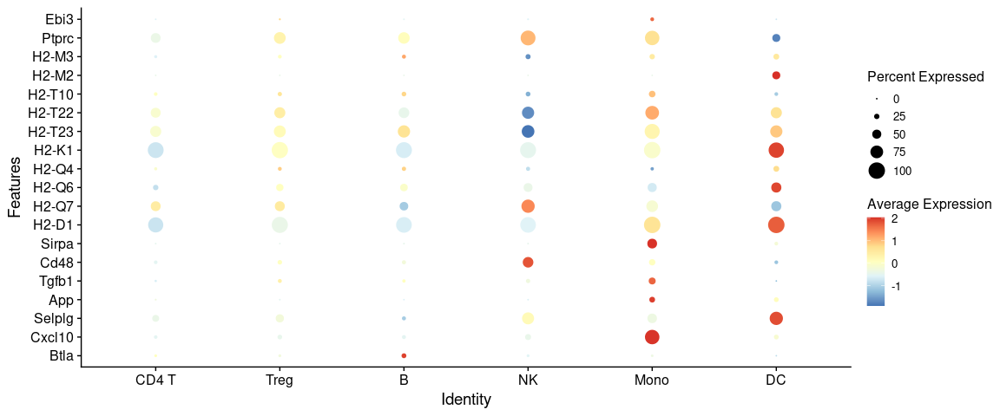
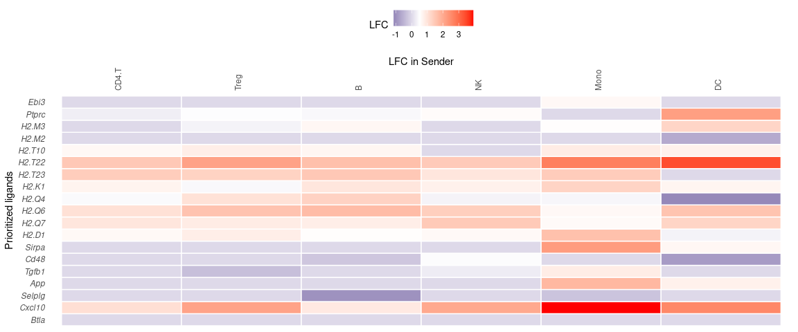
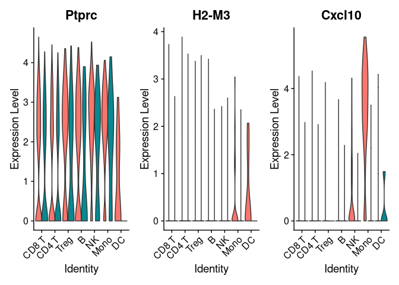
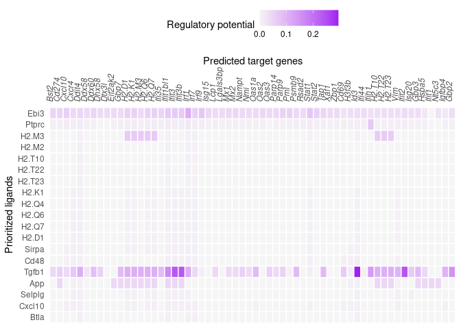
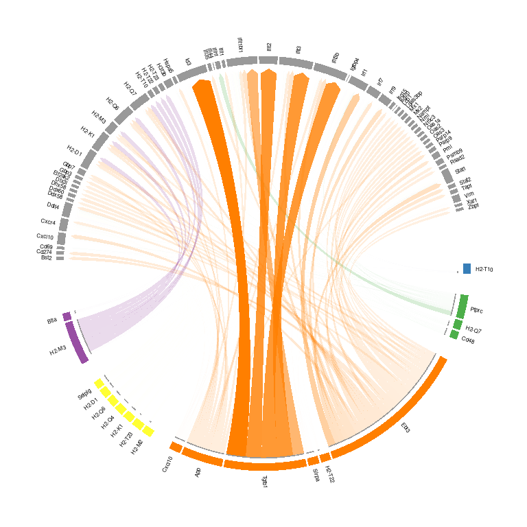
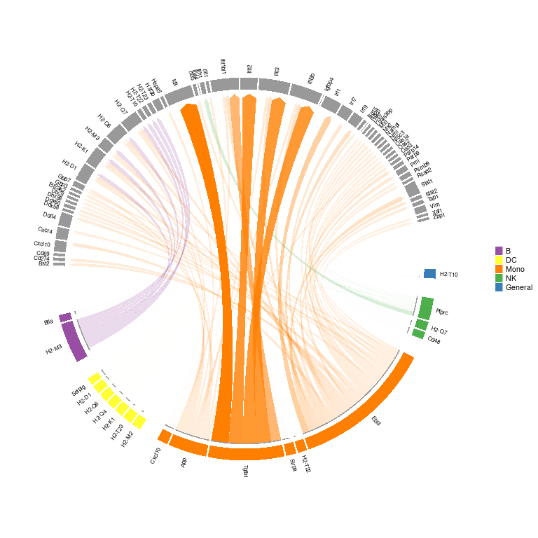

Seurat Wrapper + Circos visualization
================
Robin Browaeys
2023-10-02

<!-- github markdown built using 
rmarkdown::render("vignettes/seurat_wrapper_circos.Rmd", output_format = "github_document")
-->

In this vignette, you can learn how to visualize the output of a
NicheNet analysis in a circos plot (also called a chord diagram) via the
`circlize` package. This vignette follows the same workflow as shown in
[Perform NicheNet analysis starting from a Seurat
object](seurat_wrapper.md).

This vignette was made upon popular request to demonstrate how those two
vignettes can be combined into one analysis workflow. Note that we as
developers of NicheNet generally recommend a visualization of the output
by combining several heatmaps (ligand activity, ligand-target links,
ligand-receptor links, ligand expression, ligand LFC,…) over using a
circos plot visualization. This is especially true for cases with many
sender cell types and ligands that are expressed by more than one sender
cell type. Because in those cases, the circos plot is much less
informative and could lead to wrong interpretation of the results.

We will again use the NICHE-seq data from Medaglia et al. (2017), which
profiles several immune cell types in the T cell area in the inguinal
lymph node before and 72 hours after lymphocytic choriomeningitis virus
(LCMV) infection. You can download the [NicheNet
networks](https://doi.org/10.5281/zenodo.7074290) and the [Seurat object
of the processed NICHE-seq single-cell
data](https://doi.org/10.5281/zenodo.3531889) from Zenodo.

# Prepare NicheNet analysis

### Load packages

``` r
library(nichenetr) # Please update to v2.0.4
library(Seurat)
library(SeuratObject)
library(tidyverse)
library(circlize)
```

### Read in NicheNet’s networks

``` r
ligand_target_matrix <- readRDS(url("https://zenodo.org/record/7074291/files/ligand_target_matrix_nsga2r_final_mouse.rds"))
lr_network <- readRDS(url("https://zenodo.org/record/7074291/files/lr_network_mouse_21122021.rds"))
weighted_networks <- readRDS(url("https://zenodo.org/record/7074291/files/weighted_networks_nsga2r_final_mouse.rds"))
head(lr_network)
## # A tibble: 6 × 4
##   from          to    database source  
##   <chr>         <chr> <chr>    <chr>   
## 1 2300002M23Rik Ddr1  omnipath omnipath
## 2 2610528A11Rik Gpr15 omnipath omnipath
## 3 9530003J23Rik Itgal omnipath omnipath
## 4 a             Atrn  omnipath omnipath
## 5 a             F11r  omnipath omnipath
## 6 a             Mc1r  omnipath omnipath
```

### Read in the expression data of interacting cells

``` r
seuratObj <- readRDS(url("https://zenodo.org/record/3531889/files/seuratObj.rds"))

# For newer Seurat versions, you may need to run the following
seuratObj <- UpdateSeuratObject(seuratObj)

# Convert gene names
seuratObj <- alias_to_symbol_seurat(seuratObj, "mouse")
```

# Perform the NicheNet analysis

For this analysis, we define the receiver cell population as the ‘CD8 T’
cell population, and the sender cell populations as ‘CD4 T’, ‘Treg’,
‘Mono’, ‘NK’, ‘B’ and ‘DC’. We consider a gene to be expressed when it
is expressed in at least 10% of cells in one cluster (default).

The gene set of interest are the genes differentially expressed in CD8 T
cells after LCMV infection. The condition of interest is thus ‘LCMV’,
whereas the reference/steady-state condition is ‘SS’. The notion of
conditions can be extracted from the metadata column ‘aggregate’, the
method to calculate the differential expression is the standard Seurat
Wilcoxon test.

The number of top-ranked ligands that are further used to predict active
target genes and construct an active ligand-receptor network is 30 by
default, but we will only choose the top 20 to not overcrowd the circos
plot.

**Note:** Cell types should be the identities of the seurat object
(check using `table(Idents(seuratObj))`)

``` r
sender_celltypes <- c("CD4 T","Treg", "Mono", "NK", "B", "DC")
nichenet_output <- nichenet_seuratobj_aggregate(
  seurat_obj = seuratObj, 
  receiver = "CD8 T", 
  condition_colname = "aggregate",
  condition_oi = "LCMV", condition_reference = "SS", 
  sender = sender_celltypes, 
  ligand_target_matrix = ligand_target_matrix,
  lr_network = lr_network,
  weighted_networks = weighted_networks,
  top_n_ligands = 20)
## [1] "Read in and process NicheNet's networks"
## [1] "Define expressed ligands and receptors in receiver and sender cells"
## [1] "Perform DE analysis in receiver cell"
## [1] "Perform NicheNet ligand activity analysis"
## [1] "Infer active target genes of the prioritized ligands"
## [1] "Infer receptors of the prioritized ligands"
## [1] "Perform DE analysis in sender cells"
```

### Interpret the NicheNet analysis output

#### Ligand activity analysis results

A first thing NicheNet does, is prioritizing ligands based on predicted
ligand activity. To see the ranking of these ligands, run the following
command:

``` r
nichenet_output$ligand_activities
## # A tibble: 73 × 6
##    test_ligand auroc  aupr aupr_corrected pearson  rank
##    <chr>       <dbl> <dbl>          <dbl>   <dbl> <dbl>
##  1 Ebi3        0.663 0.390          0.244   0.301     1
##  2 Ptprc       0.642 0.310          0.165   0.167     2
##  3 H2-M3       0.608 0.292          0.146   0.179     3
##  4 H2-M2       0.611 0.279          0.133   0.153     5
##  5 H2-T10      0.611 0.279          0.133   0.153     5
##  6 H2-T22      0.611 0.279          0.133   0.153     5
##  7 H2-T23      0.611 0.278          0.132   0.153     7
##  8 H2-K1       0.605 0.268          0.122   0.142     8
##  9 H2-Q4       0.605 0.268          0.122   0.141    10
## 10 H2-Q6       0.605 0.268          0.122   0.141    10
## # ℹ 63 more rows
```

These ligands are expressed by one or more of the input sender cells. To
see which cell population expresses which of these top-ranked ligands,
you can run the following:

``` r
nichenet_output$ligand_expression_dotplot
```

<!-- -->

As you can see, most of the top-ranked ligands seem to be mainly
expressed by dendritic cells and monocytes.

It could also be interesting to see whether some of these ligands are
differentially expressed after LCMV infection.

``` r
nichenet_output$ligand_differential_expression_heatmap
```

<!-- -->

``` r
VlnPlot(seuratObj, features = c("Ptprc", "H2-M3", "Cxcl10"), split.by = "aggregate", pt.size = 0, combine = TRUE)
```

<!-- -->

#### Inferred active ligand-target links

NicheNet also infers active target genes of these top-ranked ligands. To
see which top-ranked ligands are predicted to have regulated the
expression of which differentially expressed genes, you can run
following command for a heatmap visualization:

``` r
nichenet_output$ligand_target_heatmap
```

<!-- -->

## Circos plots to visualize ligand-target and ligand-receptor interactions

This visualization groups the top predicted active ligands according to
the strongest expressing cell type. Therefore we need to determine per
cell type which ligands they express more strongly than the other cell
types.

### Assign ligands to sender cells

To assign ligands to sender cell type, we can look for which sender cell
types show a mean expression that is higher than the mean + one standard
deviation. You can change the functions to aggregate the counts
(`func.agg`, default is the mean) and function to assign the ligands
(`func.assign`, default is mean + SD). Ligands that are expressed higher
than `func.assign` in more than one cell type and ligands that are not
assigned to any cell type are assigned to “General”.

``` r
ligand_type_indication_df <- assign_ligands_to_celltype(seuratObj,
                                                        nichenet_output$top_ligands,
                                                        celltype_col = "celltype") 

ligand_type_indication_df %>% head()
##   ligand_type ligand
## 1           B  H2-M3
## 2           B   Btla
## 3          NK  Ptprc
## 4          NK  H2-Q7
## 5          NK   Cd48
## 6        Mono   Ebi3
ligand_type_indication_df$ligand_type %>% table()
## .
##       B      DC General    Mono      NK 
##       2       8       1       6       3
```

### Define the ligand-target links of interest

We will need the ligand-target links from the NicheNet output. To avoid
making a circos plots with too many ligand-target links, we will show
only links with a weight higher than a predefined cutoff: links
belonging to the 40% of lowest scores were removed. Not that this
cutoffs and other cutoffs used for this visualization can be changed
according to the user’s needs.

``` r
head(nichenet_output$ligand_target_df)
## # A tibble: 6 × 3
##   ligand target weight
##   <chr>  <chr>   <dbl>
## 1 Ebi3   Bst2   0.0500
## 2 Ebi3   Cd274  0.0504
## 3 Ebi3   Cxcl10 0.0570
## 4 Ebi3   Cxcr4  0.0430
## 5 Ebi3   Ddit4  0.0485
## 6 Ebi3   Ddx58  0.0402

active_ligand_target_links_df <- nichenet_output$ligand_target_df
active_ligand_target_links_df$target_type <- "LCMV-DE" # needed for joining tables
circos_links <- get_ligand_target_links_oi(ligand_type_indication_df,
                                           active_ligand_target_links_df,
                                           cutoff = 0.40) 

head(circos_links)
## # A tibble: 6 × 5
##   ligand target weight target_type ligand_type
##   <chr>  <chr>   <dbl> <chr>       <chr>      
## 1 Ebi3   Bst2   0.0500 LCMV-DE     Mono       
## 2 Ebi3   Cd274  0.0504 LCMV-DE     Mono       
## 3 Ebi3   Cxcl10 0.0570 LCMV-DE     Mono       
## 4 Ebi3   Cxcr4  0.0430 LCMV-DE     Mono       
## 5 Ebi3   Ddit4  0.0485 LCMV-DE     Mono       
## 6 Ebi3   Ddx58  0.0402 LCMV-DE     Mono
```

Prepare the circos visualization by giving each segment of ligands and
targets a specific color and order, as well as gaps between different
cell types. By default, cell types are ordered alphabetically, followed
by “General” (then they are drawn counter-clockwise). Users can give a
specific order to the cell types by providing a vector of cell types to
the argument `celltype_order`. The gaps between the different segments
can also be defined by providing a named list to the argument `widths`.

``` r
ligand_colors <- c("General" = "#377EB8", "NK" = "#4DAF4A", "B" = "#984EA3",
                   "Mono" = "#FF7F00", "DC" = "#FFFF33", "Treg" = "#F781BF",
                   "CD8 T"= "#E41A1C") 
target_colors <- c("LCMV-DE" = "#999999") 

vis_circos_obj <- prepare_circos_visualization(circos_links,
                                               ligand_colors = ligand_colors,
                                               target_colors = target_colors,
                                               celltype_order = NULL) 
```

Render the circos plot where all links have the same transparency. Here,
only the widths of the blocks that indicate each target gene is
proportional the ligand-target regulatory potential (~prior knowledge
supporting the regulatory interaction).

``` r

draw_circos_plot(vis_circos_obj, transparency = FALSE,  args.circos.text = list(cex = 0.5)) 
```

<!-- -->

Render the circos plot where the degree of transparency determined by
the regulatory potential value of a ligand-target interaction.

``` r
draw_circos_plot(vis_circos_obj, transparency = TRUE,  args.circos.text = list(cex = 0.5)) 
```

<!-- -->

To create a legend for the circos plot, we can use the
`ComplexHeatmap::Legend` function and creating a gTree object from it
with `grid::grid.grabExpr`. As the circos plot is drawn on base R
graphics (i.e., it is not a ggplot object), we will get the plot using
`recordPlot()`.

``` r
par(bg = "transparent")

# Default celltype order
celltype_order <- unique(circos_links$ligand_type) %>% sort() %>% .[. != "General"] %>% c(., "General")

# Create legend
circos_legend <- ComplexHeatmap::Legend(
  labels = celltype_order,
  background = ligand_colors[celltype_order],
  type = "point",
  grid_height = unit(3, "mm"),
  grid_width = unit(3, "mm"),
  labels_gp = grid::gpar(fontsize = 8)
  )

circos_legend_grob <- grid::grid.grabExpr(ComplexHeatmap::draw(circos_legend))

draw_circos_plot(vis_circos_obj, transparency = TRUE, args.circos.text = list(cex = 0.5))
p_circos_no_legend <- recordPlot()
```

We can combine the circos plot and the legend using
`cowplot::plot_grid`.

``` r
cowplot::plot_grid(p_circos_no_legend, circos_legend_grob, rel_widths = c(1, 0.1))
```

<!-- -->

We can save this plot to an svg file.

``` r
svg("ligand_target_circos.svg", width = 10, height = 10)
cowplot::plot_grid(p_circos_no_legend, circos_legend_grob, rel_widths = c(1, 0.1))
dev.off()
```

### Visualize ligand-receptor interactions of the prioritized ligands in a circos plot

To create a ligand-receptor chord diagram, we can perform similar steps
as above using the weighted ligand-receptor dataframe instead. However,
as as `prepare_circos_visualization` accesses “target” and “target_type”
columns, it is necessary to rename the columns accordingly even though
the dataframe contains receptor and not target gene information.

``` r
lr_network_top_df <- nichenet_output$ligand_receptor_df %>%
  mutate(target_type = "LCMV_CD8T_receptor") %>%
  rename(target=receptor) %>%
  inner_join(ligand_type_indication_df)

receptor_colors <- c("LCMV_CD8T_receptor" = "#E41A1C")

vis_circos_receptor_obj <- prepare_circos_visualization(lr_network_top_df,
                                                        ligand_colors = ligand_colors,
                                                        target_colors = receptor_colors) 
```

When drawing the plot, the argument `link.visible` = TRUE is also
necessary for making all links visible, since no cutoff is used to
filter out ligand-receptor interactions.

``` r
draw_circos_plot(vis_circos_receptor_obj, transparency = FALSE,
                 link.visible = TRUE,  args.circos.text = list(cex = 0.8)) 
```

<!-- -->

Just as above, if `transparency = TRUE`, the degree of transparency is
determined by the prior interaction weight of the ligand-receptor
interaction.

### FAQ: How to draw a double circos plot of ligand-receptor-target links?

Please check the [HNSCC case study + double circos visualization](circos_plot.md) for the demonstration.

``` r
sessionInfo()
## R version 4.3.2 (2023-10-31)
## Platform: x86_64-redhat-linux-gnu (64-bit)
## Running under: CentOS Stream 8
## 
## Matrix products: default
## BLAS/LAPACK: /usr/lib64/libopenblaso-r0.3.15.so;  LAPACK version 3.9.0
## 
## locale:
##  [1] LC_CTYPE=en_US.UTF-8       LC_NUMERIC=C               LC_TIME=en_US.UTF-8        LC_COLLATE=en_US.UTF-8     LC_MONETARY=en_US.UTF-8   
##  [6] LC_MESSAGES=en_US.UTF-8    LC_PAPER=en_US.UTF-8       LC_NAME=C                  LC_ADDRESS=C               LC_TELEPHONE=C            
## [11] LC_MEASUREMENT=en_US.UTF-8 LC_IDENTIFICATION=C       
## 
## time zone: Asia/Bangkok
## tzcode source: system (glibc)
## 
## attached base packages:
## [1] stats     graphics  grDevices utils     datasets  methods   base     
## 
## other attached packages:
##  [1] circlize_0.4.15    forcats_1.0.0      stringr_1.5.0      dplyr_1.1.4        purrr_1.0.2        readr_2.1.2        tidyr_1.3.0       
##  [8] tibble_3.2.1       ggplot2_3.4.4      tidyverse_1.3.1    SeuratObject_5.0.1 Seurat_4.4.0       nichenetr_2.0.4   
## 
## loaded via a namespace (and not attached):
##   [1] fs_1.6.3               matrixStats_1.2.0      spatstat.sparse_3.0-3  bitops_1.0-7           lubridate_1.9.3        httr_1.4.7            
##   [7] RColorBrewer_1.1-3     doParallel_1.0.17      tools_4.3.2            sctransform_0.4.0      backports_1.4.1        utf8_1.2.4            
##  [13] R6_2.5.1               lazyeval_0.2.2         uwot_0.1.16            GetoptLong_1.0.5       withr_2.5.2            sp_2.1-2              
##  [19] gridExtra_2.3          fdrtool_1.2.17         progressr_0.14.0       cli_3.6.2              spatstat.explore_3.2-1 labeling_0.4.3        
##  [25] spatstat.data_3.0-3    randomForest_4.7-1.1   proxy_0.4-27           ggridges_0.5.5         pbapply_1.7-2          foreign_0.8-85        
##  [31] parallelly_1.36.0      limma_3.56.2           readxl_1.4.3           rstudioapi_0.15.0      gridGraphics_0.5-1     visNetwork_2.1.2      
##  [37] generics_0.1.3         shape_1.4.6            ica_1.0-3              spatstat.random_3.2-2  car_3.1-2              Matrix_1.6-4          
##  [43] ggbeeswarm_0.7.2       fansi_1.0.6            S4Vectors_0.38.1       abind_1.4-5            lifecycle_1.0.4        yaml_2.3.8            
##  [49] carData_3.0-5          recipes_1.0.7          Rtsne_0.17             grid_4.3.2             promises_1.2.1         crayon_1.5.2          
##  [55] miniUI_0.1.1.1         lattice_0.21-9         haven_2.4.3            cowplot_1.1.2          pillar_1.9.0           knitr_1.45            
##  [61] ComplexHeatmap_2.16.0  rjson_0.2.21           future.apply_1.11.0    codetools_0.2-19       leiden_0.3.9           glue_1.6.2            
##  [67] data.table_1.14.10     vctrs_0.6.5            png_0.1-8              spam_2.10-0            cellranger_1.1.0       gtable_0.3.4          
##  [73] assertthat_0.2.1       gower_1.0.1            xfun_0.41              mime_0.12              prodlim_2023.08.28     survival_3.5-7        
##  [79] timeDate_4032.109      iterators_1.0.14       hardhat_1.3.0          lava_1.7.3             DiagrammeR_1.0.10      ellipsis_0.3.2        
##  [85] fitdistrplus_1.1-11    ROCR_1.0-11            ipred_0.9-14           nlme_3.1-163           RcppAnnoy_0.0.21       irlba_2.3.5.1         
##  [91] vipor_0.4.5            KernSmooth_2.23-22     rpart_4.1.21           colorspace_2.1-0       BiocGenerics_0.46.0    DBI_1.1.3             
##  [97] Hmisc_5.1-0            nnet_7.3-19            ggrastr_1.0.2          tidyselect_1.2.0       compiler_4.3.2         rvest_1.0.2           
## [103] htmlTable_2.4.1        xml2_1.3.6             plotly_4.10.0          shadowtext_0.1.2       checkmate_2.3.1        scales_1.3.0          
## [109] caTools_1.18.2         lmtest_0.9-40          digest_0.6.33          goftest_1.2-3          spatstat.utils_3.0-4   rmarkdown_2.11        
## [115] htmltools_0.5.7        pkgconfig_2.0.3        base64enc_0.1-3        highr_0.10             dbplyr_2.1.1           fastmap_1.1.1         
## [121] rlang_1.1.2            GlobalOptions_0.1.2    htmlwidgets_1.6.2      shiny_1.7.1            farver_2.1.1           zoo_1.8-12            
## [127] jsonlite_1.8.8         ModelMetrics_1.2.2.2   magrittr_2.0.3         Formula_1.2-5          dotCall64_1.1-1        patchwork_1.1.3       
## [133] munsell_0.5.0          Rcpp_1.0.11            ggnewscale_0.4.9       reticulate_1.34.0      stringi_1.7.6          pROC_1.18.5           
## [139] MASS_7.3-60            plyr_1.8.9             parallel_4.3.2         listenv_0.9.0          ggrepel_0.9.4          deldir_2.0-2          
## [145] splines_4.3.2          tensor_1.5             hms_1.1.3              igraph_1.2.11          ggpubr_0.6.0           spatstat.geom_3.2-7   
## [151] ggsignif_0.6.4         reshape2_1.4.4         stats4_4.3.2           reprex_2.0.1           evaluate_0.23          modelr_0.1.8          
## [157] tzdb_0.4.0             foreach_1.5.2          tweenr_2.0.2           httpuv_1.6.13          RANN_2.6.1             polyclip_1.10-6       
## [163] future_1.33.0          clue_0.3-64            scattermore_1.2        ggforce_0.4.1          broom_0.7.12           xtable_1.8-4          
## [169] e1071_1.7-14           rstatix_0.7.2          later_1.3.2            viridisLite_0.4.2      class_7.3-22           beeswarm_0.4.0        
## [175] IRanges_2.34.1         cluster_2.1.4          timechange_0.2.0       globals_0.16.2         caret_6.0-94
```
